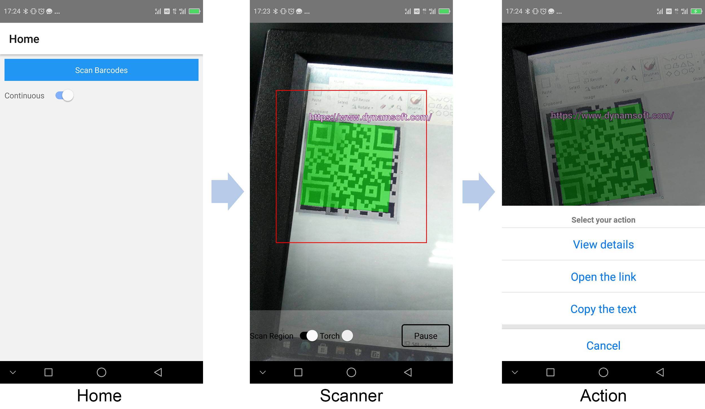

# react-native-qrcode-scanner

A React Native QR Code Scanner demo using Vision Camera and the [Dynamsoft Barcode Reader plugin](https://github.com/tony-xlh/vision-camera-dynamsoft-barcode-reader).

## How to run

1. npm install
2. cd `ios` and run `pod install`
3. npx react-native run-android or run-ios

## Blog

[Build a React Native QR Code Scanner using Vision Camera](https://www.dynamsoft.com/codepool/react-native-qr-code-scanner-vision-camera.html)

